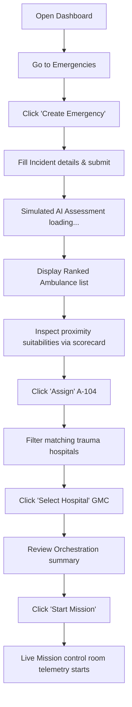
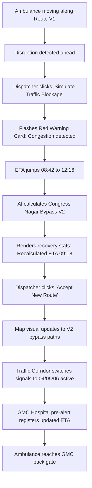
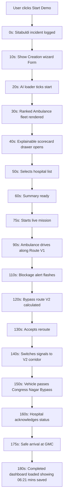

# Complete User Journeys & Flowcharts

This document charts the user paths, workflow decisions, and automated demo chronologies inside **NAGPUR RESQ**.

---

## 1. Manual Incident Dispatch Workflow

This flowchart maps the operational dispatch wizard steps:

---

## 2. Dynamic Blockage & Recalculation Flow

This flowchart maps how route disruptions are handled:

---

## 3. Automated Hackathon Demo timeline

This flowchart maps the automated demo mode steps:

